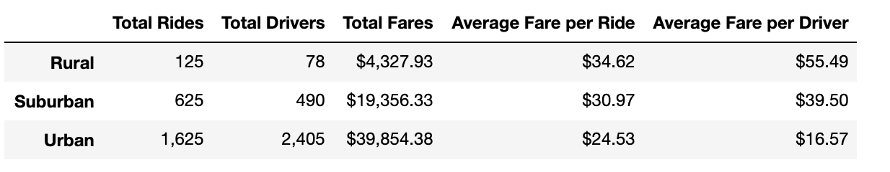

# PyBer_Analysis


## Table of Contents
* [Project title](#project-title)
* [Technologies](#technologies)
* [Overview](#overview)
* [Results](#results)
* [Summary](#summary)


## Project title
PyBer Analysis - Module 5 Challenge 

## Technologies
[Python](https://www.python.org/downloads/ "Download Python") 3.7.9.

## Overview 
PyBer, a ride-sharing app company valued at $2.3 billion, has assigned a project: analyze all the rideshare data ([PyBer ride data](https://github.com/Bominkkwon/PyBer_Analysis/blob/main/Resources/ride_data.csv), [City data](https://github.com/Bominkkwon/PyBer_Analysis/blob/main/Resources/city_data.csv), which consist of lists of cities, types of cities, dates, fares, ride ID, number of drivers from January to early May of 2019) and create a compelling visualization for the CEO. By creating visualizations of rideshare data for PyBer, the company would be able help improve access to ride-sharing services and determine affordability for underserved neighborhoods. One can also create a summary DataFrame of the ride-sharing data by city type and a multiple-line graph that shows the total weekly fares for each city type by using this script. This script is extremly helpful to summarize how the data differs by city type and how those differences can be used by decision-makers at PyBer.


(I have also noticed that when your Github Appearance setting (https://github.com/settings/appearance) is "Default Dark," some of the labels of these charts do not show on Readme.md-- Please switch to "Default Light" to resolve this issue)


## Results

In order to create visualizations, the script will merge the two datasets that were given and create the Rural, Suburban, and Urban DataFrames:
```Python
# Combine the data into a single dataset
pyber_data_df = pd.merge(ride_data_df, city_data_df, how="left", on=["city", "city"])

# Create the Urban, Suburban, Rural city DataFrames.
urban_cities_df = pyber_data_df[pyber_data_df["type"] == "Urban"]
suburban_cities_df = pyber_data_df[pyber_data_df["type"] == "Suburban"]
rural_cities_df = pyber_data_df[pyber_data_df["type"] == "Rural"]
```

 

("% of Total Fares by City Type" (Fig 5))
```Python
sum_fares_by_type = pyber_data_df.groupby(["type"]).sum()["fare"]
total_fares = pyber_data_df["fare"].sum()
type_percents = 100 * sum_fares_by_type / total_fares
```
The sum of the fares for each city type are: 
* Rural $4,327.93 
* Suburban $19,356.33 
* Urban $39,854.38

In the pie chart above (labeled, "Fig 5"), more than half of the total fares has been charged in "Urban" areas and the fares that has been charged in "Rural" areas are a little more than 10% of the fares charged in "Urban" areas. One can conclude that the company has produced higher "revenue" in "Urban" areas compared to in "Rural" or "Suburban." 


("% of Total Rides by City Type" (Fig 6))
```Python
pyber_data_df.groupby(["type"])
pyber_data_df.groupby(["type"]).count()
ride_percents = 100 * pyber_data_df.groupby(["type"]).count()["ride_id"] / pyber_data_df["ride_id"].count()
```

The total number of riders during this particular period is 2,375 and in the pie chart above (labeled, "Fig 6"), 68.4% of the total number of PyBer ride service has been used in "Urban" areas and 5.3% in "Rural" areas; and "Suburban" has the second most riders. One can conclude that such lack of PyBer riders in "Rural" areas is something that the company has to look into further because it could become problematic.


("% of Total Drivers by City Type" (Fig 7))
```Python
driver_percents = 100 * city_data_df.groupby(["type"]).sum()["driver_count"] /city_data_df["driver_count"].sum()
```

As "Fig 6" has shown, the demand for PyBer ride service is high in "Urban" areas-- in order to cover such high requests, more drivers are needed in "Urban" areas and the pie chart (Fig 7) is showing that 80.9% of total drivers have provided services in "Urban" areas during this period. There has been a noticeable trend that recognize the importance of demands for PyBer in "Urban" areas and its contributions to the company.


## Summary




The days of owning a vehicle is fading away. Our future generations are adapting to the sharing economy, instead of buying and owning products, consumers are increasingly interested in leasing and sharing them-- this is why one of many reasons that companies like PyBer is high in demand and moving forward, will face a lot of competitions. In order to stay ahead of the curve, PyBer needs to innovate and use a data driven strategy. There are some recommendations that PyBer could use to imporve their company based on these given datasets:

1. A lot of "Urban" riders are likely to be using PyBer multiple times per week or even per day-- PyBer could potentially utilitze this and create (Monthly/bi-weekly) subscription services with attractive prices. This will seem very appealing to a lot of urban commuters who does not want to use public transportations or those frequent urban riders who are looking to save on travel costs. This would only benefits the company if the newly created subscription services are restricted within a city.

2. To improve the overall numbers of riders in "Suburban" areas, the company could utilize the current trends of green investments. PyBer could encourage those who use or interested in trying PyBer by providing attractive fares if they decided to ride such eco-friendly vehicles. In many suburban areas, inadequate transportation infrastructure is an issue and encouraging them to share their rides in green vehicles would give them more options than just owning a vehicle and deter them from purchasing a vehicle. This would also encourage those "Suburban" drivers to work for PyBer, because it would mean less or no cost for fuels.

3. In "Rural" areas, it is difficult to make more investment to improve the numbers of riders and drivers-- since the issue is not just about the company nor the people there; it has a lot to do with market penetration. Some of them may not even own a cell phone or does not even know such riding share apps like "PyBer" exists. This is not something that the company can improve or change overnight. Rather than cutting back the riding services there, the company could utilize this to have different experimentations. Experimentation is a bit like innovation-- since a lot of companies are investing their time and energy to develop autonomous vehicles, PyBer could partner with them or get them to sponsor and try it out in "Rural" areas. 

In my opinion, car ownership is so inefficient-- and creations of such "ride- sharing" applications are truly moving America away from being a car-dependent society. These recommendations were made based solely on those given datasets and I believe these would improve the company in many ways. 


